# Arlend — Premium Wooden Posters & Merchandise Platform

> 🟡 **Platform is live. Business is currently undergoing strategic changes.**
> The platform is fully operational at **[arlend.store](https://arlend.store)** — feel free to explore it.

---

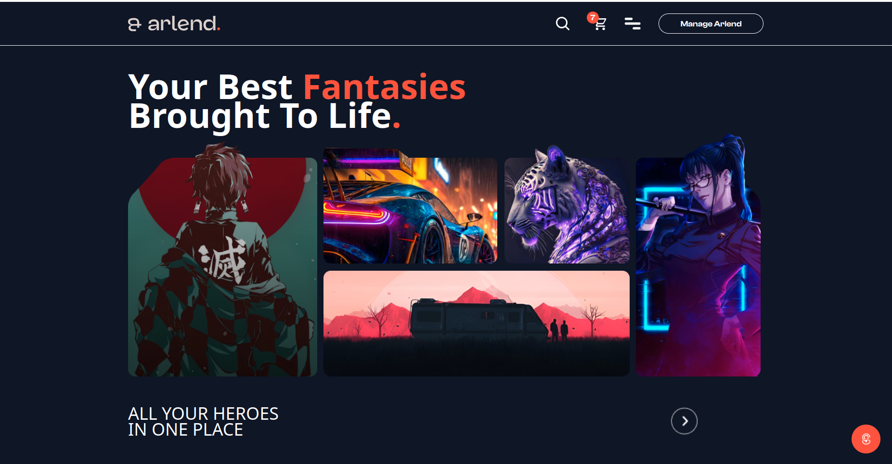
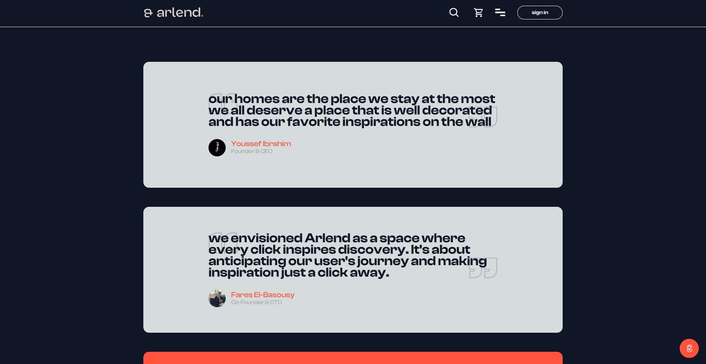

---

## What is Arlend?

Arlend is a premium merchandise startup focused on one thing: making unique, rich wooden posters and stickers for fans of popular shows, movies, anime, and art styles.

Every product is built with premium materials — crazy durable wooden posters with vivid, high-quality printing that actually elevates your space, alongside detailed sticker designs as a secondary line.

This isn't just another print-on-demand shop. The designs are original, the materials are premium, and the platform was built to match that standard — from the browsing experience down to the order pipeline.

I co-founded Arlend as the sole technical founder alongside a creative director. Every line of code, every architecture decision, and every system in this platform was designed and shipped by me.

> 📬 **Available for new opportunities and freelance projects**
> [LinkedIn](https://www.linkedin.com/in/fares-el-basousy-87424b167/) · [GitHub](https://github.com/Fares-Basousy/) · faresbasousy@gmail.com

---

## Table of Contents

- [Product](#-the-product)
- [Tech Stack](#-tech-stack)
- [Architecture](#-architecture)
- [Features Walkthrough](#-features-walkthrough)
  - [Product Discovery](#-product-discovery)
  - [Product Pages](#️-product-pages)
  - [Authentication & Security](#-authentication--security)
  - [Commerce](#-commerce)
  - [Order Lifecycle](#-order-lifecycle)
  - [Notifications & Support](#-notifications--support)
  - [Admin Dashboard](#️-admin-dashboard)
  - [Performance & SEO](#-performance--seo)

---

## 🪵 The Product

Arlend sells two things, and sells them well:

**Wooden Posters** — Premium wall art featuring original designs inspired by popular shows, movies, anime, and art styles. Printed with a method that ensures vivid, lasting colors on durable wooden material. Built for decoration and merchandise.

**Stickers** — Detailed, high-quality sticker designs as a secondary product line. Same design standard, different format.

Every product is positioned as a premium item — the platform was built to reflect that from the first page load.

---

## 🛠 Tech Stack

| Layer | Technology |
|---|---|
| Frontend | Next.js, TypeScript, Tailwind CSS |
| Backend | NestJS, Node.js |
| Database | MongoDB |
| Auth | JWT, Google OAuth |
| Payments | Payment Gateway Integration |
| Infrastructure | Docker, Cloud Deployment |
| SEO | SSR, Structured Metadata, Semantic HTML |

---

## 🏗 Architecture

The platform is built on a **client-server architecture** with a clear separation between what the client owns and what the server owns.

### Overview

```
┌─────────────────────────────────────────────────────────────┐
│                        CLIENT (Next.js)                      │
│                                                              │
│   Session Handling · Product Viewing · UI State Management  │
│   SSR Pages · Data Presentation · User Interactions         │
│                                                              │
│              Layered File Structure Architecture             │
└──────────────────────────┬──────────────────────────────────┘
                           │  HTTP / REST
                           │
┌──────────────────────────▼──────────────────────────────────┐
│                        SERVER (NestJS)                       │
│                                                              │
│   ┌──────────┐  ┌──────────┐  ┌──────────┐  ┌──────────┐  │
│   │   Auth   │  │ Products │  │ Payments │  │  Emails  │  │
│   │  Module  │  │  Module  │  │  Module  │  │  Module  │  │
│   └──────────┘  └──────────┘  └──────────┘  └──────────┘  │
│                                                              │
│   ┌──────────┐  ┌──────────┐  ┌──────────┐                 │
│   │  Orders  │  │Shipping  │  │  Users   │                 │
│   │  Module  │  │  Module  │  │  Module  │                 │
│   └──────────┘  └──────────┘  └──────────┘                 │
│                                                              │
│              Modular Architecture (NestJS)                   │
└──────────────────────────┬──────────────────────────────────┘
                           │
┌──────────────────────────▼──────────────────────────────────┐
│                        DATABASE                              │
│                         MongoDB                              │
└─────────────────────────────────────────────────────────────┘
```

### Client Side — Next.js (Layered File Structure)
The client is responsible for session handling, product presentation, and all user-facing interactions. Built with SSR at its core — pages are server-rendered by default, keeping load times fast and search indexing reliable. The file structure follows a layered approach separating pages, components, hooks, and services cleanly.

### Server Side — NestJS (Modular Architecture)
The server owns all business logic. Each module has a single, well-defined responsibility — auth doesn't touch payments, emails don't touch products. This separation keeps the codebase maintainable and each module independently testable. The payment flow, order management, and shipping integration all live server-side by design — the client never handles sensitive business operations directly.

### Database — MongoDB
MongoDB was chosen for its flexibility with product data — each product type has its own structure and display pattern, making a document-based database a natural fit over a rigid relational schema.

---

## 🔎 Features Walkthrough

---

### 🔍 Product Discovery

**Trending Section**
Cached and auto-refreshed weekly — surfaces the most relevant products without any manual curation needed.

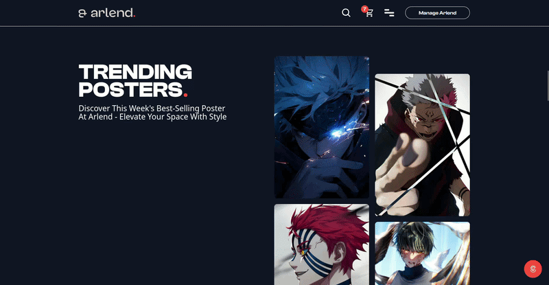

---

**Browse & Quick Search**
Full product browsing with a navbar quick-search for instant results by name or attribute.

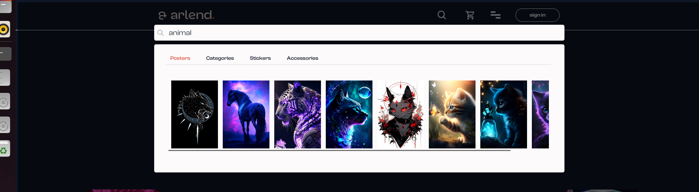
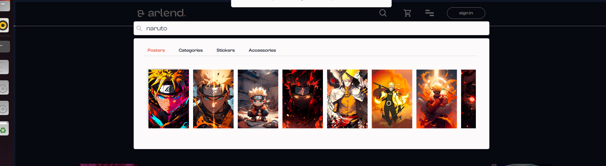
---

**Advanced Filtering**

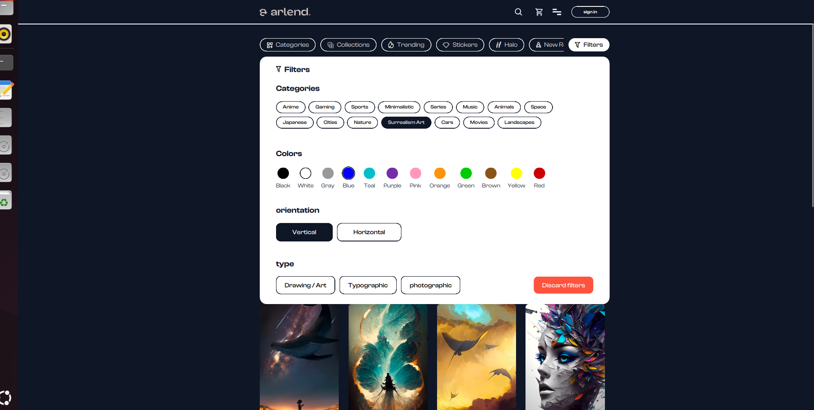

---

**Infinite Scroll Pagination**
Zero duplicate products across pages — handled at the query level, not patched at the UI level.


---

### 🗂️ Product Pages

**Multi-Product Type Display**
Each product category — posters, stickers — renders with its own distinct layout and interaction pattern. Not a single generic template stretched to fit everything.

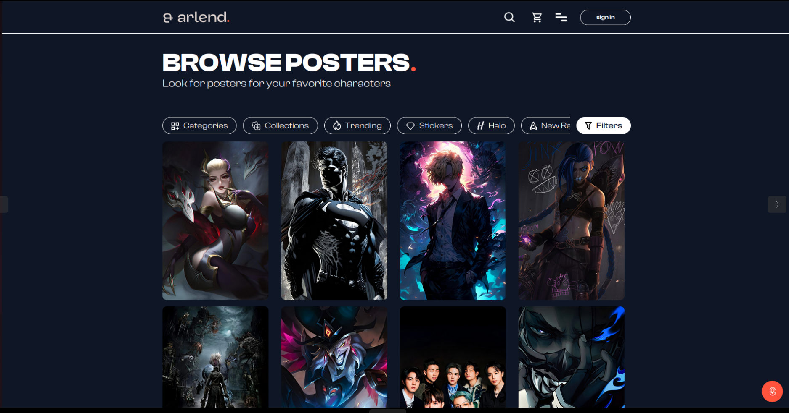
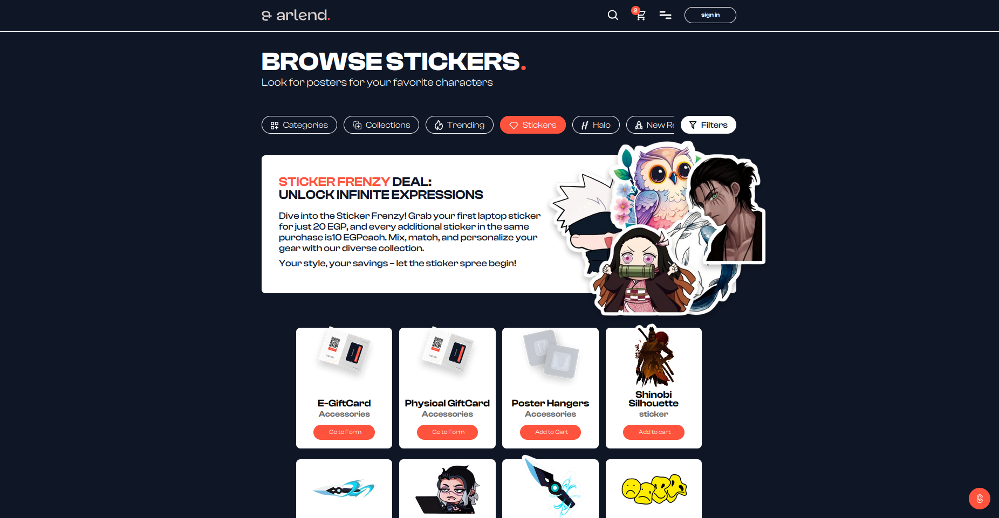

---

**Product Customization**

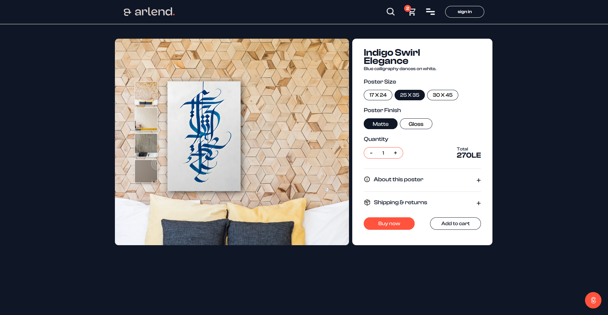

---

### 🔐 Authentication & Security

**Sign Up / Sign In**

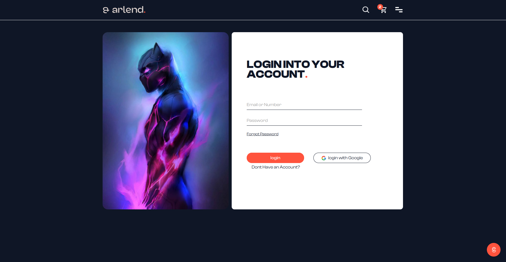

---

**Google OAuth with Account Linking**
Connects to an existing account or provisions a new one automatically on first sign-in — no duplicate records, no extra steps for the user.

---

**OTP Password Recovery**
Automated email flow with a one-time password for secure account recovery.

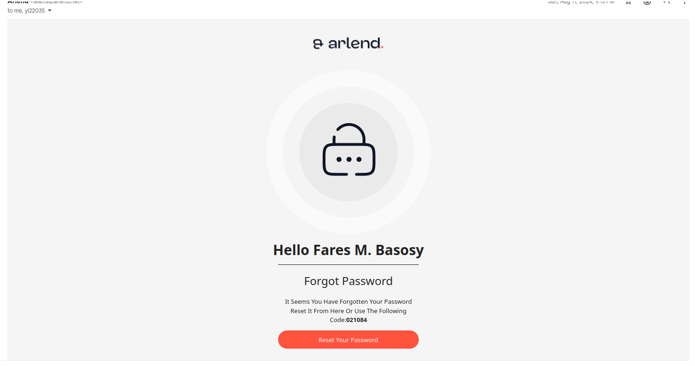
---

### 🛒 Commerce

**Cart**
Session-synchronized — persists across devices and page reloads without a manual save.

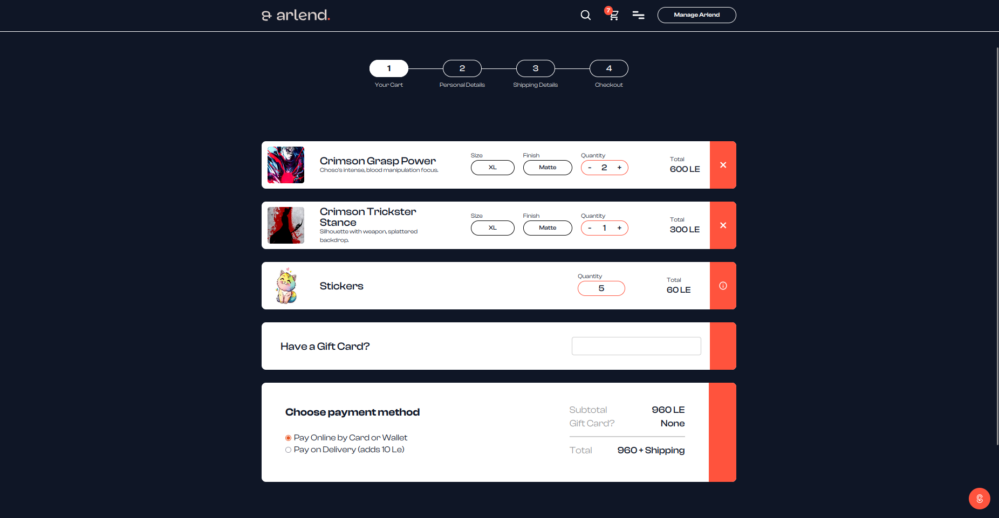
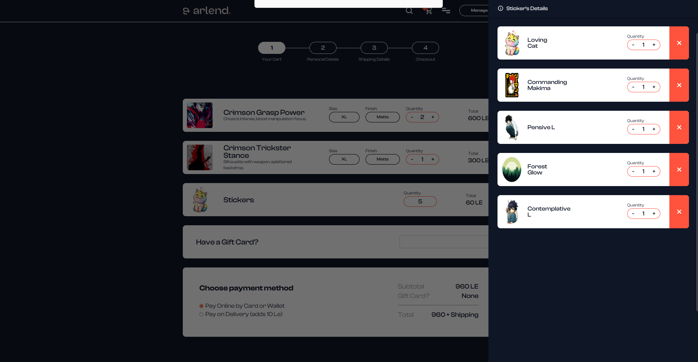

---

**Favorites**

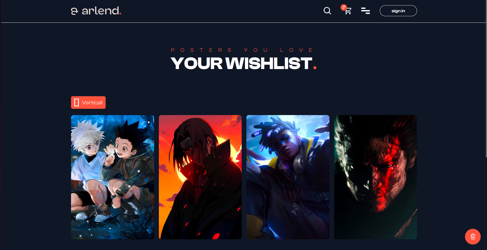

---

**Gift Cards**
Purchasable gift cards with redeemable credit balances applied at checkout.

---

**Payment Integration**
Secure payment gateway with a full order confirmation flow — all payment logic lives server-side.

---

### 📦 Order Lifecycle

**Order Confirmation & Tracking**
Users follow their order across the full pipeline — from manufacturing through dispatch to delivery.

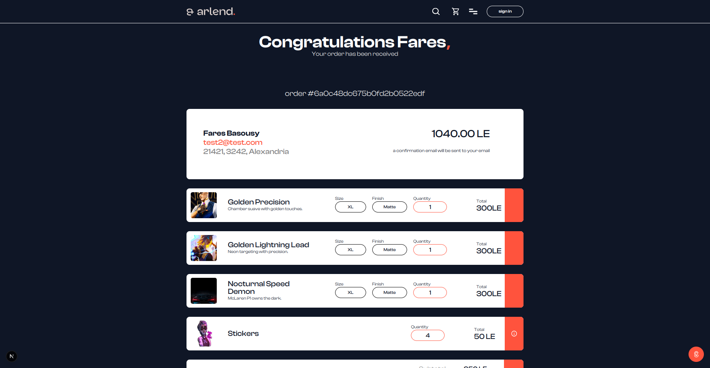

---

**Shipping Integration**
Real-time shipping updates on the user end. On the company side, an automated workflow handles fulfillment without manual intervention.

---

### 🔔 Notifications & Support

**Toaster Notification System**
Customized toasters across all key interactions — cart actions, auth events, order updates, and errors. Each event has its own styled notification rather than a generic one-size-fits-all toast.


---

**Hover Support Icon**
A persistent support icon is accessible from anywhere on the platform. Hovering or clicking brings up a support screen — keeping help reachable without interrupting the browsing experience.

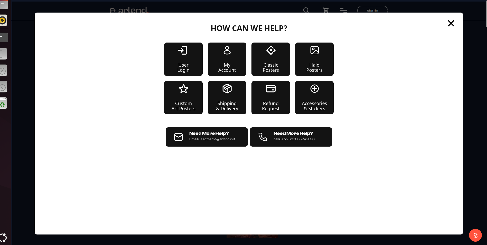
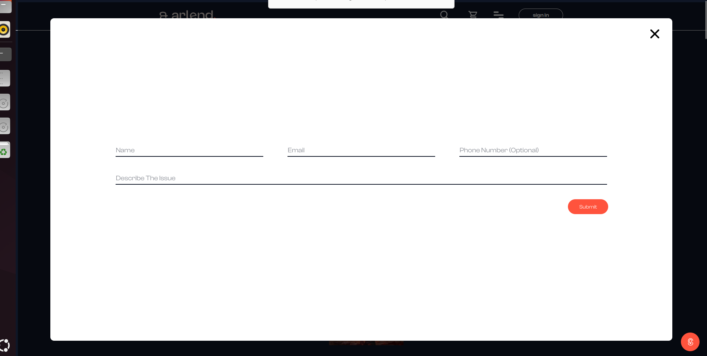


### ⚙️ Admin Dashboard

**Product & Order Management**
Internal dashboard for managing inventory, orders, and operational workflows — no codebase changes needed for day-to-day operations.

---

**Automated Email Flows**
Order confirmations, shipping updates, and account recovery emails are all triggered automatically. Zero manual sending.


---

### ⚡ Performance & SEO

**Server-Side Rendering**
SSR was the architectural foundation from day one — not bolted on later. Every product page is server-rendered, which directly drove Google Search indexing and kept load performance consistent across the catalog.

---

**Google Search Indexing**
The platform achieved organic Google Search visibility through semantic HTML, structured metadata, and SSR — validating that real users were finding and reaching the store.

---

## Built By

**Fares El-Basousy**
Software Engineer · AWS Certified Solutions Architect

[](https://www.linkedin.com/in/fares-el-basousy-87424b167/)
[](https://github.com/Fares-Basousy/)
[](mailto:faresbasousy@gmail.com)
[](https://www.credly.com/badges/541537db-4498-4141-b62f-b214778c12ef/public_url)
